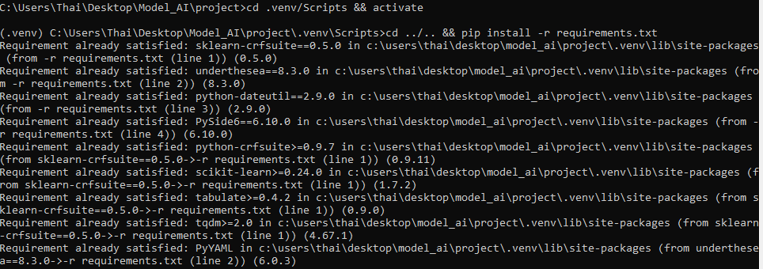
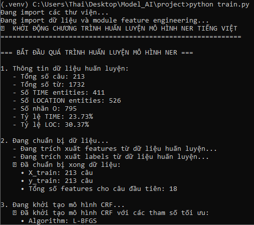
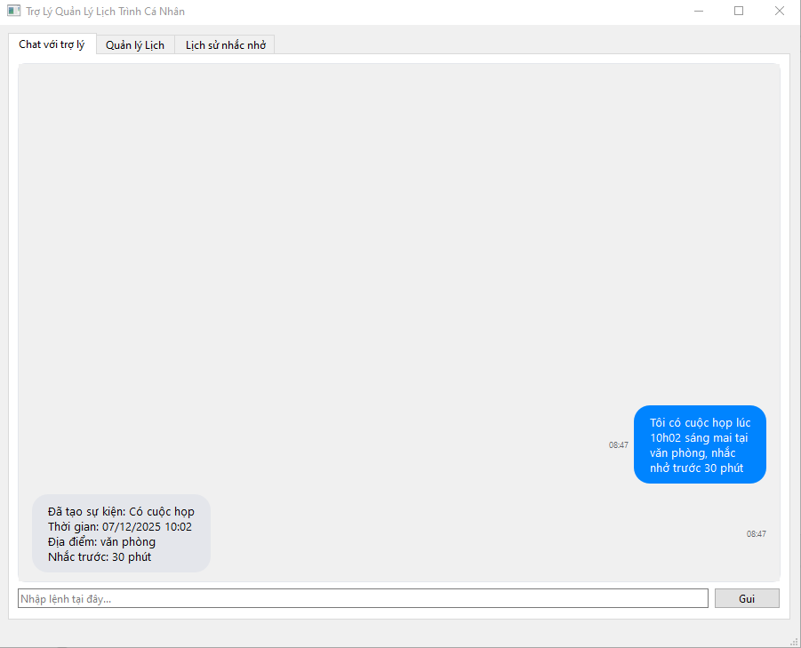
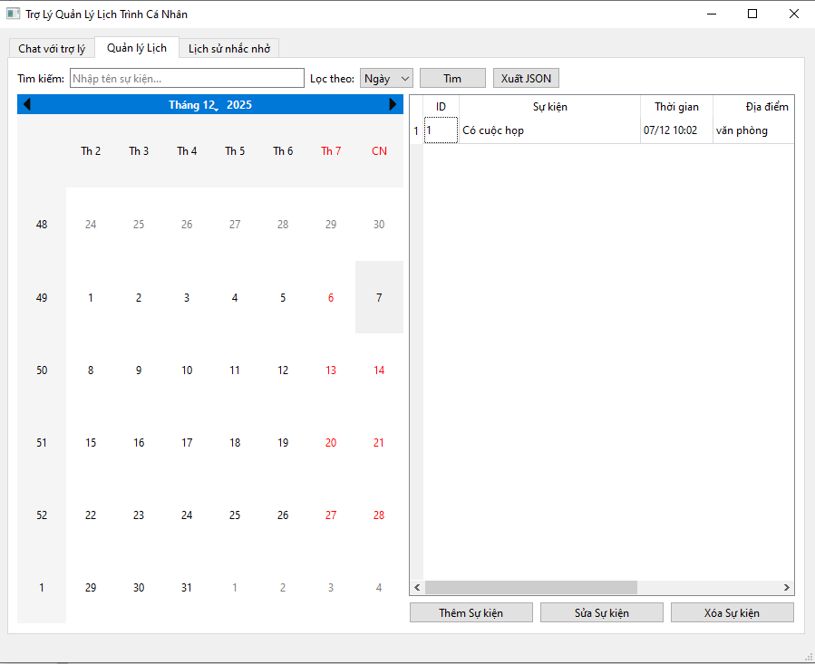
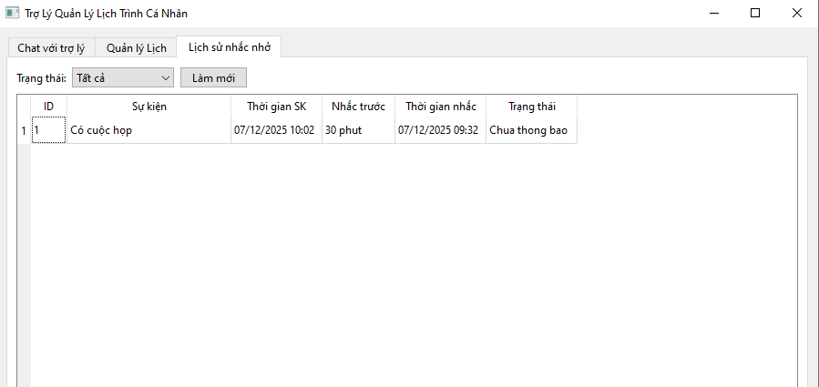
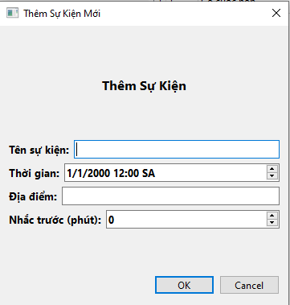

# Ứng dụng Quản lý Sự kiện với NLP Tiếng Việt

Ứng dụng quản lý sự kiện thông minh sử dụng kỹ thuật **Named Entity Recognition (NER)** với mô hình **CRF (Conditional Random Fields)** để tự động trích xuất thông tin sự kiện từ câu tiếng Việt tự nhiên.

## Tính năng

- **Nhập bằng ngôn ngữ tự nhiên**: Tạo sự kiện bằng câu tiếng Việt
- **Phân tích thời gian thông minh**: Hiểu "10h", "sáng mai", "thứ Ba tuần sau"
- **Trích xuất địa điểm**: Tự động nhận diện "phòng 101", "văn phòng"
- **Hỗ trợ nhắc nhở**: Đặt nhắc theo phút, giờ, hoặc giây
- **Hỗ trợ tiếng Việt**: Hoạt động với cả có dấu và không dấu
- **Lưu trữ SQLite**: Lưu trữ sự kiện lâu dài
- **Thông báo tự động**: Hệ thống nhắc nhở chạy nền

## Bắt đầu nhanh

### Yêu cầu hệ thống

- Python 3.10 trở lên
- Windows 10/11 (64-bit)

### Cài đặt

```bash
# Di chuyển vào thư mục project
cd project

# Tạo môi trường ảo
python -m venv .venv

# Kích hoạt môi trường ảo (Windows)
.venv\Scripts\activate

# Cài đặt các thư viện
pip install -r requirements.txt

# Huấn luyện model (lần đầu)
python train.py

# Chạy ứng dụng
python main.py
```

**Hình 1: Tạo môi trường ảo và kích hoạt**



**Hình 2: Chạy huấn luyện model**



## Ví dụ sử dụng

Nhập các câu tiếng Việt tự nhiên:

```
# Đơn giản
Họp 10h
Meeting 14h30

# Có địa điểm
Họp team 10h tại phòng 101
Gặp khách ở văn phòng 15h

# Có nhắc nhở
Họp 10h nhắc trước 15 phút
Meeting 14h báo trước 1 tiếng

# Ngày tương đối
Họp 10h sáng mai
Gặp đối tác thứ Ba tuần sau

# Phức tạp
Toi co cuoc hop lúc 1 giờ 30 tai văn phong, nhắc truoc 15p
```

## Định dạng đầu ra

```json
{
  "event": "Họp team",
  "start_time": "2025-12-07T10:00:00",
  "end_time": null,
  "location": "phòng 101",
  "reminder_minutes": 15
}
```

## Kiến trúc hệ thống

```
+------------------------------------------------+
|              Giao diện người dùng              |
|  (Chat Widget, Bảng sự kiện, Form sự kiện)     |
+------------------------+-----------------------+
                         |
+------------------------v-----------------------+
|               NLP Pipeline                      |
|  +----------+ +----------+ +--------------+    |
|  |Trích xuất|>|Dự đoán   |>|Trích xuất    |    |
|  |đặc trưng | |CRF Model | |Rule-based    |    |
|  +----------+ +----------+ +--------------+    |
|                     |                          |
|              +------v------+                   |
|              |Phân giải    |                   |
|              |thời gian    |                   |
|              +-------------+                   |
+------------------------------------------------+
```

## Cấu trúc thư mục

```
project/
├── main.py                 # Điểm khởi đầu
├── nlp_pipeline.py         # Điều phối NLP
├── feature_engineering.py  # Trích xuất đặc trưng
├── train.py                # Huấn luyện model
├── training_data.py        # Dữ liệu huấn luyện
├── predict.py              # Dự đoán NER
├── component_3.py          # Trích xuất rule-based
├── component_4.py          # Phân giải thời gian
├── database_manager.py     # Thao tác SQLite
├── reminder_thread.py      # Nhắc nhở chạy nền
├── chat_widget.py          # Giao diện chat
├── ui_mainwindow.py        # Giao diện chính
├── ner_crf.model           # Model đã huấn luyện
├── test_suite.py           # 30 test cases
├── requirements.txt        # Thư viện cần thiết
└── README.md               # File này
```

## Kiểm thử

Chạy bộ test để kiểm tra độ chính xác:

```bash
# Với hỗ trợ UTF-8 (khuyến nghị)
chcp 65001 && python -X utf8 test_suite.py

# Chạy đơn giản
python test_suite.py
```

Kết quả:
```
Tổng số test: 30
Đạt: 28
Không đạt: 2
Độ chính xác: 93.3%
```

## Công nghệ sử dụng

| Thành phần | Công nghệ |
|------------|-----------|
| Mô hình NER | sklearn-crfsuite (CRF) |
| Giao diện | PySide6 |
| Cơ sở dữ liệu | SQLite |
| Ngôn ngữ | Python 3.10+ |

## Thư viện phụ thuộc

```
PySide6==6.10.0
sklearn-crfsuite==0.5.0
underthesea==8.3.0
python-dateutil==2.9.0
joblib>=1.3.0        
pyinstaller==6.17.0 
```

## Các bước xử lý NLP

1. **Tokenization và trích xuất đặc trưng** - Tách từ, trích xuất features
2. **Dự đoán NER** - Mô hình CRF dự đoán nhãn IOB (TIME, LOC)
3. **Trích xuất Rule-based** - Trích xuất thông tin nhắc nhở bằng regex
4. **Phân giải thời gian** - Chuyển đổi thời gian tương đối sang datetime
5. **Định dạng đầu ra** - Tạo JSON có cấu trúc

## Các mẫu được hỗ trợ

### Biểu thức thời gian
- Giờ: `10h`, `10h30`, `22h50`, `10:30`, `10 giờ 35 phút`
- Buổi: `sáng`, `trưa`, `chiều`, `tối`, `đêm`
- Ngày: `hôm nay`, `mai`, `mốt`, `ngày 25`, `25/12`
- Thứ: `thứ Hai`, `thứ Ba`, `chủ nhật`
- Tuần: `tuần sau`, `cuối tuần`

### Địa điểm
- Phòng: `phòng 101`, `phòng họp A`
- Nơi chốn: `văn phòng`, `hội trường`, `quán cà phê`
- Địa chỉ: `tại công ty`, `ở trường`

### Nhắc nhở
- Phút: `nhắc trước 5 phút`, `báo trước 30p`
- Giờ: `nhắc trước 2 tiếng`, `báo trước 1h`
- Giây: `nhắc trước 60 giây`, `remind before 30s`

## Giao diện ứng dụng

### Tab Chat với Trợ lý



### Tab Quản lý Lịch



### Tab Lịch sử Nhắc nhở



### Form Thêm Sự kiện Mới


